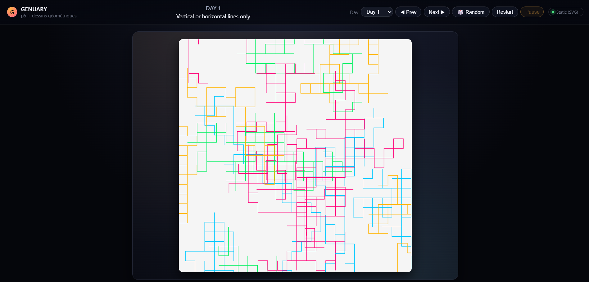

# Genuary

This project is a school assignment **loosely inspired by _Genuary_**, a generative art challenge with one prompt per day in January.

## Description

- Each **day** corresponds to a **prompt** (e.g. “Vertical or horizontal lines only”, “Lava lamp”, “Pixel sorting”, etc.).
- The visuals are generated with **p5.js** and the **dessins géométriques** library by [v3ga].
- The interface lets you pick a day and display the corresponding sketch (some in canvas, some as SVG).

In line with the assignment, **all the code and sketch ideas were created with the help of an AI assistant**. 

> ⚠️ The project must be opened through a **local server** (e.g. VS Code’s *Live Server*).  
> Opening `index.html` directly in the browser will not work because of ES module imports and dynamic loading.

The site also includes a small **“non-AI” chatbot** built with **RiveScript** and **p5.js**.