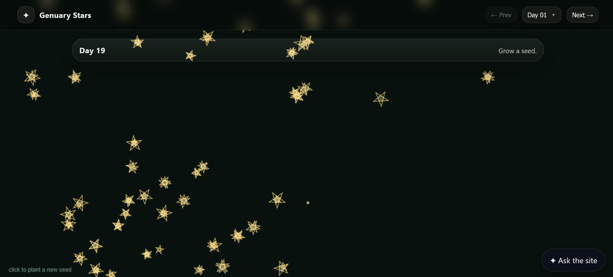

# ✦ Genuary
A generative art project inspired by **Genuary** -
31 prompts, 31 sketches, all built from a single evolving star drawing.



---

## ✧ Tech

* **p5.js** - rendering & interaction
* **v3ga – dessins géométriques** - base drawing system
* **JavaScript** - structure & dynamic imports
* **CSS** - layout & visuals
* **RiveScript** - rule-based chatbot

---

## ✧ Chatbot

The site includes a small chatbot:

* Built with **RiveScript**
* Fully **rule-based (non-AI)**
* Answers questions about:

  * the project
  * the prompts
  * the code structure

---

## ✧ Notes

* This project was created as a **school assignment**
* In line with the assignment, **all the code and sketch ideas were created with the help of an AI assistant**. 

---

## ✧ Running the project

You **must use a local server**:

```bash
# example (VS Code)
Right click index.html → "Open with Live Server"
```

Opening the file directly will not work due to:

* ES module imports
* dynamic sketch loading

